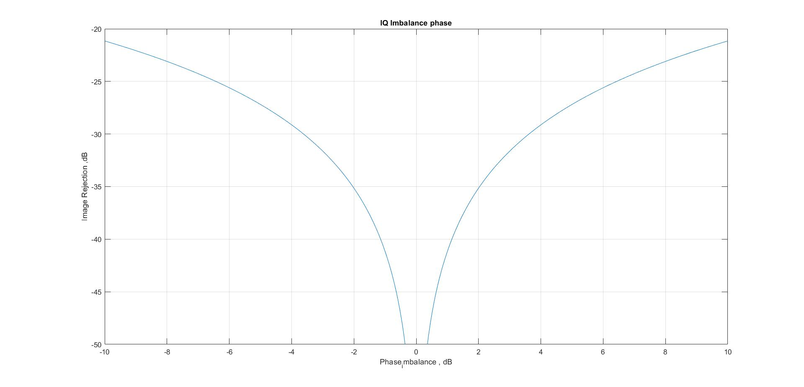

# IQ Imbalance Analysis and Correction

## Overview

The code is divided into two main sections:
1. **IQ Imbalance Analysis**: This section analyzes how different gain and phase imbalances affect the signal.
2. **IQ Imbalance Correction**: This section implements a correction technique based on the computed gain and phase imbalances.


## Sections
1. [IQ Imbalance Gain Analysis](#1-iq-imbalance-gain-analysis)
2. [IQ Imbalance Phase Analysis](#2-iq-imbalance-phase-analysis)
3. [IQ Imbalance Phase Correction](#3-iq-imbalance-correction)

### 1. IQ Imbalance Gain Analysis

This section simulates the effect of **gain imbalance** by varying it across a range of values using `logspace`. The imbalance between the I (In-phase) and Q (Quadrature) components is computed, and the **image rejection** is calculated using the Fast Fourier Transform (FFT).

#### Key Steps:
- The signal is generated for various gain imbalances.
- FFT is applied to measure signal distortion.
- **Image rejection** is computed and plotted against the **gain imbalance** in decibels (dB).

#### Code Snippet:
```matlab
for gain_imbalance = logspace(-3,3,10000)
    I = cos(2*pi*f*time);
    Q = gain_imbalance * sin (2*pi*f*time - phase_imbalance);
    out = I + j * Q;
    w = fftshift(abs(fft(out)));
    IQ_Imbalance(i) = 20*log10(max( w(1:500))/(max( w(500:1000))));
end
```

#### Plot: `IQ Imbalance Gain`
- Displays **Image Rejection (dB)** vs. **Gain Imbalance (dB)**.
- 

### 2. IQ Imbalance Phase Analysis

In this section, **phase imbalance** is varied while keeping the gain imbalance constant. The imbalance is measured using FFT, and image rejection is plotted against the phase imbalance in degrees.

#### Code Snippet:
```matlab
for phase_imbalance = -0.2:0.001:0.2
    I = cos(2*pi*f*time);
    Q = gain_imbalance * sin (2*pi*f*time - phase_imbalance);
    out = I + j * Q;
    w = fftshift(abs(fft(out)));
    IQ_Imbalancep(i) = 20*log10(max( w(1:500))/(max( w(500:1000))));
end
```

#### Plot: `IQ Imbalance Phase`
- Displays **Image Rejection (dB)** vs. **Phase Imbalance (degrees)**.
- 

### 3. IQ Imbalance Correction

This section calculates the imbalance parameters:
- **Gain imbalance correction factor** is determined using the ratio of RMS values of I and Q.
- **Phase imbalance correction** is applied by adjusting the phase relationship between I and Q components.

The signal is corrected based on these calculated values, and the corrected signal is compared to the original signal both in the frequency domain (via FFT) and the time domain.

#### Correction Formula:
```matlab
gain_bar = rms(Q)/rms(I);
phase_bar = -sum(I .* Q)/sqrt(sum(Q .^2)* sum(I .^2));
I_new = I;
Q_new = tan(phase_bar) * I + Q / (gain_bar * cos(phase_bar));
out_corr = I_new + j * Q_new;
```

- `IQ_Imbalance =   -25.0545`

- `IQ_Imbalance_corr =  -60.8393`

#### Plot: `Frequency Domain Before and After Correction`
- Frequency domain representation before and after correction is visualized using FFT.
- **Before Correction**


- **After Correction**


#### Plot: `Time Domain After Correction`
- Time domain signal before and after correction is compared.


